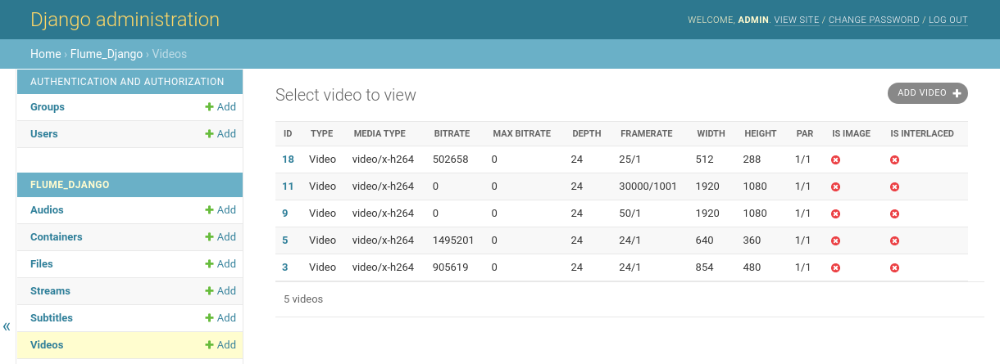

# flume-django
`Django` application to manage the `flume` database

## Features
* Seamless integration between `Django` and `flume`
* Possiblity to upload files directly through the admin interface

## Setup
In order to integrate `flume-django` into your `Django` application, you need to:

Add `flume-django` as an installed application in your `settings.py`
```python
INSTALLED_APPS = (
    ...,
    "flume_django",
)
```

Add the `flume` database to your `settings.py`, you can do it manually or use the `flume_django.config.FlumeDjangoConfig` helper

```python
from flume_django.config import FlumeDjangoConfig
config = FlumeDjangoConfig()
DATABASES = {
    "flume": {
        "ENGINE": config.get_django_database_engine(),
        "NAME": config.get_database_database(),
    },
}
```

Add the `flume-django` router in your `settings.py`
```python
DATABASE_ROUTERS = ["flume_django.router.Router"]
```

## Demo
The project has a `demo` folder, in order to run locally, make sure you have a `flume` configuration in `$HOME/.flume` or `/etc/flume` and simply run

```shell
poetry run python manage.py runserver
```
After entering into the admin site, you will see something like this:


## Development
The project is based in `poetry` dependency management and packaging system. The basic steps are

Install poetry
```
curl -sSL https://raw.githubusercontent.com/python-poetry/poetry/master/get-poetry.py | python -
```

Install the dependencies
```
poetry install
```

Install your development pre-commit hooks
```
poetry run pre-commit install
```

## License
## References
* [Flume](https://github.com/turran/flume)
* [Poetry Template](https://github.com/yunojuno/poetry-template)
